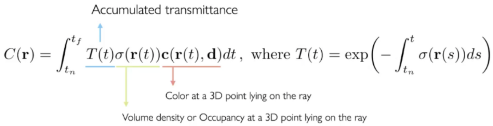
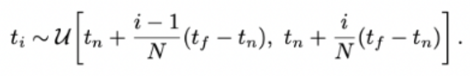
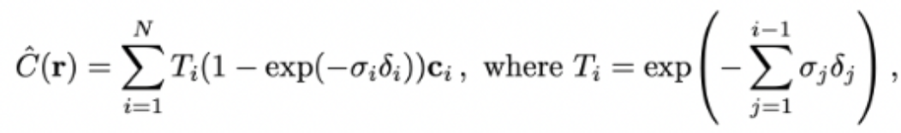
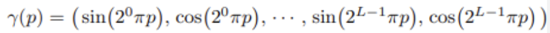
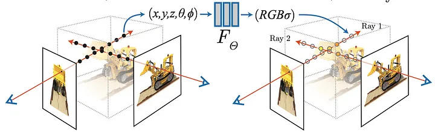

# REAL 
REAL: Render Real Estate 2D images into 3D scene with NeRF

Mainly inspired by NeRF
* [Main Reference](https://www.matthewtancik.com/nerf)
* [NeRF: Representing Scenes as Neural Radiance Fields for View Synthesis](https://arxiv.org/abs/2003.08934)
* [Neural Radiance Fields for Unconstrained Photo Collections](https://arxiv.org/abs/2008.02268)

# Training Sequence

1. MLP
   1. Mainly predict the density of the product
   2. 5-Dimension input: `x, y, z, θ, φ` -> `ρ`(density)
2. Volume Rendering
   1. One Ray -> One Pixel -> projection
   2. o(position of camera), d(viewing direction) -> ray (o+td)
   3. t: [0, 1] -> sample points along the ray
   4. T(t): trabsmittance
   5. c(r(t), d): weighted sum of real RGB values
   6. </img>
3. Stratified Sampling approach

</img>

</img>

4. Hierarchical Volume Sampling - Coarse network -> Fine network

</img>

5. Positional Encoding

</img>

</img>