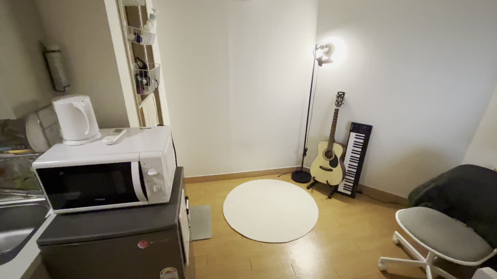

# REAL 
REAL: Render Real Estate 2D images into 3D scene with NeRF

Mainly inspired by NeRF
* [Main Reference](https://www.matthewtancik.com/nerf)
  
* [NeRF: Representing Scenes as Neural Radiance Fields for View Synthesis](https://arxiv.org/abs/2003.08934)
  
* [Neural Radiance Fields for Unconstrained Photo Collections](https://arxiv.org/abs/2008.02268)

</img>

# LLFF data - Format

* sparse/ ---- .bin
* bound_poses.npy or transforms.json, {yourdata}.txt
* check [**LLFF Repository**](https://github.com/Fyusion/LLFF) first!!

* LLFF can correct certain types of distortion in the input images, such as lens distortion and chromatic aberration, by estimating the intrinsic camera parameters of each image.

example for transformation
```
"camera_angle_x": 1.6316266081598993,
"camera_angle_y": 1.0768185778803099,
"fl_x": 903.3096914819945,
"fl_y": 904.1146220896455,
"k1": -0.0006951346026472416,
"k2": -0.0022074727073696896,
"k3": 0,
"k4": 0,
"p1": -0.00018190630274219532,
"p2": -0.00015686925639183075,
"is_fisheye": false,
"cx": 959.5738541657016,
"cy": 544.0907729519863,
"w": 1920.0,
"h": 1080.0,
"aabb_scale": 32,
"frames": [
   {
   "file_path": "./images/0017.jpg",
   ...
```

# Camera pose
`./{data}/text`

example for camera of room
```
# Camera list with one line of data per camera:
#   CAMERA_ID, MODEL, WIDTH, HEIGHT, PARAMS[]
# Number of cameras: 1
1 OPENCV 1920 1080 903.30969148199449 904.11462208964554 959.57385416570162 544.09077295198631 -0.0006951346026472416 -0.0022074727073696896 -0.00018190630274219532 -0.00015686925639183075
```

Image list
```
IMAGE_ID, QW, QX, QY, QZ, TX, TY, TZ, CAMERA_ID, NAME
POINTS2D[] as (X, Y, POINT3D_ID)
Number of images: 35, mean observations per image: 1618.6571428571428
1 0.98166594374421712 0.11018315231591673 0.14857255792029417 0.046020026852707313 -0.68943682766847558 0.8318357390927269 -2.5659713605463765 1 0017.jpg
...
```

3D points for room
```
# 3D point list with one line of data per point:
#   POINT3D_ID, X, Y, Z, R, G, B, ERROR, TRACK[] as (IMAGE_ID, POINT2D_IDX)
# Number of points: 5740, mean track length: 9.869860627177701
944 5.1531701493470319 6.0687577564030635 5.0653561052108316 112 100 78 0.78653193433340196 32 2166 18 888 33 1394 27 1595
...
```


# Execution
input : few images

</img>
</img>
</img>
 ...

<hr>

output :
interactive **openGL** viewer

Render with CUDA : [reference](https://github.com/Fyusion/LLFF#3-render-novel-views)
```
./cuda_renderer mpidir <your_posefile> <your_videofile> height crop crf
```

<hr>

trained_example.mp4

https://github.com/sabin5105/REAL/assets/50198431/e3ce1e64-8531-4430-9007-4fa3ce72cab7

# Training Sequence

1. MLP
   *  Mainly predict the density of the product
   *  5-Dimension input: `x, y, z, θ, φ` -> `ρ`(density)
  
2. Volume Rendering
   *  One Ray -> One Pixel -> projection
   *  o(position of camera), d(viewing direction) -> ray (o+td)
   *  t: [0, 1] -> sample points along the ray
   *  T(t): trabsmittance
   *  c(r(t), d): weighted sum of real RGB values
   *  </img>

3. Stratified Sampling approach

   * </img>

   * </img>

4. Hierarchical Volume Sampling - Coarse network -> Fine network

   * </img>

5. Positional Encoding

   * </img>

   * </img>

# Improvement
* [ ] Add more data
* [ ] autoamtically make llff data
* [ ] train more to make it more realistic
* [ ] build configuration
* [ ] modify the whole thing to easy to use at any data with single command

# Citation
```
@misc{lin2020nerfpytorch,
  title={NeRF-pytorch},
  author={Yen-Chen, Lin},
  publisher = {GitHub},
  journal = {GitHub repository},
  howpublished={\url{https://github.com/yenchenlin/nerf-pytorch/}},
  year={2020}
}
```
```
@article{mildenhall2019llff,
  title={Local Light Field Fusion: Practical View Synthesis with Prescriptive Sampling Guidelines},
  author={Ben Mildenhall and Pratul P. Srinivasan and Rodrigo Ortiz-Cayon and Nima Khademi Kalantari and Ravi Ramamoorthi and Ren Ng and Abhishek Kar},
  journal={ACM Transactions on Graphics (TOG)},
  year={2019},
}
```